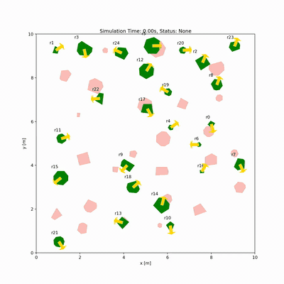
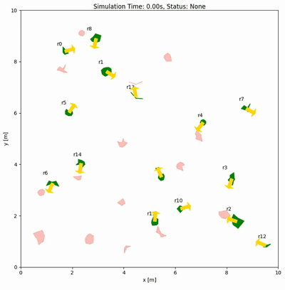
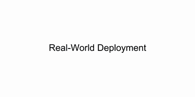

# SRL-MPC

**Shape-Aware Reinforcement Learned Model Predictive Control**

[Project Website](https://hanruihua.github.io/srl_mpc_project/) ·
[Paper](https://arxiv.org/abs/2608.21175) ·
[Demonstrations](https://hanruihua.github.io/srl_mpc_project/#demonstrations)

[Ruihua Han](https://hanruihua.github.io/)1,
[Rui Gao](https://github.com/hfr2015)2,
[Zhe Liu](https://happinesslz.github.io/)1,
[Xinyi Wang](https://lawliet9666.github.io/)3,
[Chang Chen](https://scholar.google.com/citations?hl=en&user=1jx4TqkAAAAJ)1,
[Shuai Wang](https://siat-invs.com/)4,
[Qi Hao](https://cse.sustech.edu.cn/faculty/~haoq/)2,
[Jia Pan](https://ai.hku.hk/people/academic-staff/jpan)1, and
[Hengshuang Zhao](https://hszhao.github.io/)1

1The University of Hong Kong ·
2Southern University of Science and Technology ·
3University of Michigan ·
4Shenzhen Institutes of Advanced Technology

> **TL;DR:** SRL-MPC combines shape-aware high-order control barrier functions
> (HOCBFs) with reinforcement learning for online MPC parameter adaptation,
> enabling safe and efficient navigation of heterogeneous robot shapes in dense
> crowds without geometry simplification or policy retraining.

## Overview

SRL-MPC is a distributed navigation framework for heterogeneous robot crowds.
It derives compact geometric separation features (GSFs) from circular and
convex-polygon footprints, then uses a learned policy to adapt interpretable
planning parameters from the local crowd geometry. This combines the
adaptability of reinforcement learning with explicit, model-based MPC control.

## Demos

The GIF previews play directly in the README; click one to open the full MP4.
The simulation clips are held-out randomized episodes shown at 2× speed. The
full collection is available in the
[demo gallery](https://hanruihua.github.io/srl_mpc_project/#demonstrations).

| Dense crowd: 25 robots | OOD: nonconvex unions | Real-world comparison |
|:---:|:---:|:---:|
|  |  |  |

## Architecture

  

## Code

The source code will be released upon acceptance of the paper. 
